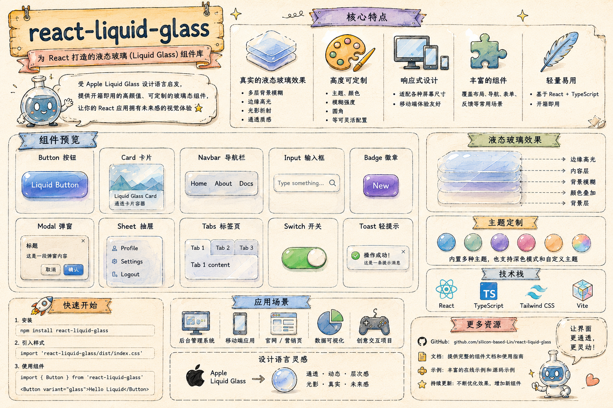

# React Liquid Glass Skill

English | [中文](#中文)

A Codex Agent Skill for implementing Apple-style Liquid Glass and frosted-glass UI surfaces in React and Next.js projects.



Demo: [examples/liquid-glass-demo.html](examples/liquid-glass-demo.html)

This repository is a human-facing distribution wrapper around the actual skill. Codex reads `SKILL.md` as the source of truth; this README explains what the skill is, how to install it, and what files are included.

## What It Does

Use this skill when you want Codex to build or replace React glass UI such as:

- mobile header category bars;
- bottom navigation and tab bars;
- floating filters and pill controls;
- transparent blurred headers;
- glassmorphism surfaces with refraction, chromatic aberration, and browser fallbacks.

The skill supports two implementation paths:

| Path | Best For | Delivery |
| --- | --- | --- |
| `simple-liquid-glass` | Apple-faithful Liquid Glass with lens modes, rim light, quality tiers, and shape adaptation | npm package |
| React Bits `GlassSurface` | Self-contained SVG displacement refraction with per-channel chromatic aberration | copied component via shadcn CLI |

## How Codex Uses It

Codex can use this skill in two ways:

- Explicitly: mention `$react-liquid-glass` in your prompt.
- Implicitly: ask for terms such as `liquid glass`, `glass surface`, `frosted glass`, `glass nav`, `transparent blur`, or `backdrop filter glass`.

The skill first gates on implementation path selection, then verifies project prerequisites before making code changes.

Example prompt:

```text
Use $react-liquid-glass to replace the mobile category header with a Liquid Glass navigation bar.
```

## Installation

### User-level Skill

Install it into a Codex skills directory:

```bash
mkdir -p "$HOME/.agents/skills"
git clone https://github.com/silicon-based-Lin/react-liquid-glass.git "$HOME/.agents/skills/react-liquid-glass"
```

If your local Codex setup uses `$CODEX_HOME/skills` or `$HOME/.codex/skills`, clone or symlink this folder there instead.

### Repository-level Skill

To make the skill available only inside one project, copy or vendor it into that repository:

```bash
mkdir -p .agents/skills
git clone https://github.com/silicon-based-Lin/react-liquid-glass.git .agents/skills/react-liquid-glass
```

Restart Codex if the skill does not appear immediately.

## Included Files

```text
react-liquid-glass/
├── SKILL.md
├── agents/
│   └── openai.yaml
└── references/
    ├── implementation-checklist.md
    └── react-bits-glass-surface.md
```

- `SKILL.md`: core Codex workflow, trigger description, gates, guardrails, and acceptance checks.
- `agents/openai.yaml`: Codex app metadata, display name, short description, default prompt, and trigger hints.
- `references/implementation-checklist.md`: Path A reference for `simple-liquid-glass`.
- `references/react-bits-glass-surface.md`: Path B reference for React Bits `GlassSurface`.

## Design Notes

- The skill is focused on React 18+ and Next.js 13+ projects.
- It avoids Three.js, WebGL, canvas, and screenshot-cloning approaches for this UI effect.
- It emphasizes SSR-safe portals, semantic controls, accessible active states, stable fixed positioning, and browser-aware fallback behavior.
- The README is documentation for people. `SKILL.md` remains the agent-facing source of truth.

## References

- [OpenAI Codex Agent Skills](https://developers.openai.com/codex/skills)
- [openai/skills](https://github.com/openai/skills)
- [awesome-codex-skills](https://github.com/ComposioHQ/awesome-codex-skills)

## 中文

[English](#react-liquid-glass-skill) | 中文

一个用于 React 和 Next.js 项目的 Codex Agent Skill，帮助 Codex 实现 Apple 风格的 Liquid Glass、毛玻璃、折射和透明悬浮 UI。

这个仓库是面向使用者和维护者的发布说明。Codex 真正读取和执行的是 `SKILL.md`；本 README 负责说明这个 skill 的用途、安装方式和目录结构。

示例 demo：[examples/liquid-glass-demo.html](examples/liquid-glass-demo.html)

## 它能做什么

当你希望 Codex 构建或替换以下 React 玻璃 UI 时，可以使用这个 skill：

- 移动端顶部分类栏；
- 底部导航和标签栏；
- 悬浮筛选器和胶囊控件；
- 透明模糊 header；
- 带折射、色差和浏览器 fallback 的 glassmorphism 表面。

这个 skill 支持两条实现路径：

| 路径 | 适合场景 | 交付方式 |
| --- | --- | --- |
| `simple-liquid-glass` | 更接近 Apple Liquid Glass，支持 lens mode、rim light、quality tier 和 shape adaptation | npm package |
| React Bits `GlassSurface` | 自包含 SVG displacement refraction，支持 RGB 通道级色差控制 | 通过 shadcn CLI 复制组件源码 |

## Codex 如何使用它

Codex 可以通过两种方式调用这个 skill：

- 显式调用：在 prompt 里写 `$react-liquid-glass`。
- 隐式调用：提出 `liquid glass`、`glass surface`、`frosted glass`、`glass nav`、`transparent blur` 或 `backdrop filter glass` 等需求。

skill 会先确认实现路径，再检查项目先决条件，满足条件后才进入代码修改。

示例 prompt：

```text
Use $react-liquid-glass to replace the mobile category header with a Liquid Glass navigation bar.
```

## 安装

### 用户级 Skill

安装到 Codex 的 skills 目录：

```bash
mkdir -p "$HOME/.agents/skills"
git clone https://github.com/silicon-based-Lin/react-liquid-glass.git "$HOME/.agents/skills/react-liquid-glass"
```

如果你的本地 Codex 使用 `$CODEX_HOME/skills` 或 `$HOME/.codex/skills`，也可以把这个目录 clone 或 symlink 到对应位置。

### 仓库级 Skill

如果只希望某一个项目能使用这个 skill，可以把它放进该项目仓库：

```bash
mkdir -p .agents/skills
git clone https://github.com/silicon-based-Lin/react-liquid-glass.git .agents/skills/react-liquid-glass
```

如果 Codex 没有立刻识别到新 skill，重启 Codex。

## 文件结构

```text
react-liquid-glass/
├── SKILL.md
├── agents/
│   └── openai.yaml
└── references/
    ├── implementation-checklist.md
    └── react-bits-glass-surface.md
```

- `SKILL.md`：核心 Codex 工作流、触发描述、路径选择、约束和验收检查。
- `agents/openai.yaml`：Codex app 的展示名称、简短描述、默认 prompt 和触发提示。
- `references/implementation-checklist.md`：Path A，也就是 `simple-liquid-glass` 的实施参考。
- `references/react-bits-glass-surface.md`：Path B，也就是 React Bits `GlassSurface` 的实施参考。

## 设计说明

- 这个 skill 面向 React 18+ 和 Next.js 13+ 项目。
- 不用 Three.js、WebGL、canvas 或截图克隆来实现这个 UI 效果。
- 重点关注 SSR-safe portal、语义化控件、可访问 active state、稳定的 fixed 定位，以及不同浏览器下的 fallback。
- README 面向人阅读；`SKILL.md` 仍然是 agent 执行时的唯一事实来源。

## 参考资料

- [OpenAI Codex Agent Skills](https://developers.openai.com/codex/skills)
- [openai/skills](https://github.com/openai/skills)
- [awesome-codex-skills](https://github.com/ComposioHQ/awesome-codex-skills)
